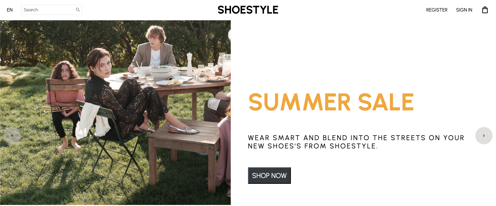
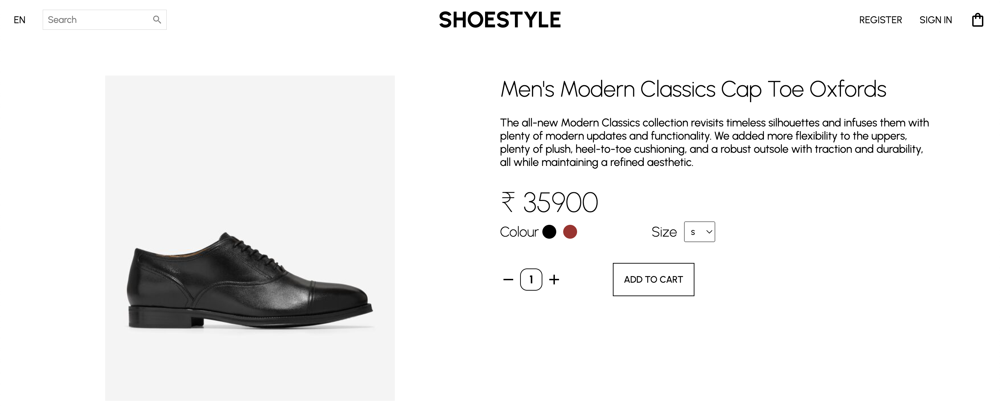

# Shoestyle Web Application

Shoestyle is a full-featured web application built for showcasing and selling stylish footwear. It is built with React, MongoDB, Redux, Stripe, Express, and Node.js.

## Table of Contents

- [Shoestyle Web Application](#shoestyle-web-application)
  - [Table of Contents](#table-of-contents)
  - [Features](#features)
  - [Sample Images](#sample-images)
    - [Home Page](#home-page)
    - [Category Page](#category-page)
    - [Product Listing](#product-listing)
    - [Shopping Cart](#shopping-cart)
  - [Installation](#installation)
  - [Usage](#usage)
  - [Technologies](#technologies)
  - [Contributing](#contributing)
  - [License](#license)

## Features

- **Product Listings**: Browse a variety of shoes with detailed descriptions and high-quality images.
- **User Authentication**: Secure sign-up and login features.
- **Shopping Cart**: Add, remove, and manage products in the shopping cart.
- **Payment Processing**: Secure payment integration with Stripe.
- **Order Management**: Track and manage orders.
- **Responsive Design**: Optimized for both desktop and mobile devices.

## Sample Images

Here are some screenshots of the Shoestyle web application:

### Home Page



### Category Page


### Product Listing


### Shopping Cart



## Installation

To run this project locally, follow these steps:

1. **Clone the repository**:

   ```bash
   git clone https://github.com/your-username/shoestyle.git
   cd shoestyle
   ```

2. **Install server dependencies**:

   ```bash
   cd server
   npm install
   ```

3. **Install client dependencies**:

   ```bash
   cd ../client
   npm install
   ```

4. **Set up environment variables**:

   - Create a `.env` file in the `server` directory and add your MongoDB URI and Stripe API keys.

5. **Run the application**:
   - Start the server:
     ```bash
     cd server
     npm start
     ```
   - Start the client:
     ```bash
     cd ../client
     npm start
     ```

## Usage

After completing the installation steps, you can access the application in your browser at `http://localhost:3000`.

## Technologies

- **Frontend**:

  - React: For building the user interface
  - Redux: For state management
  - CSS/Bootstrap: For styling

- **Backend**:

  - Node.js: For server-side JavaScript
  - Express: For creating the RESTful API
  - MongoDB: For the database

- **Payment Processing**:
  - Stripe: For handling secure payments

## Contributing

Contributions are welcome! Please follow these steps:

1. Fork the repository.
2. Create a new branch (`git checkout -b feature/YourFeature`).
3. Commit your changes (`git commit -m 'Add some feature'`).
4. Push to the branch (`git push origin feature/YourFeature`).
5. Open a pull request.

## License

This project is licensed under the MIT License. See the [LICENSE](LICENSE) file for details.
